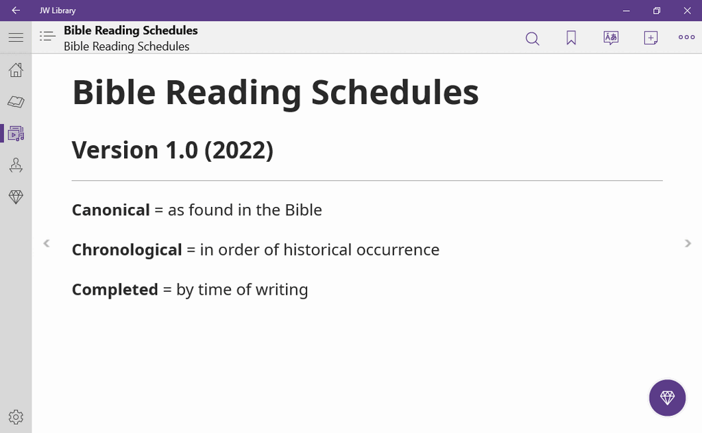
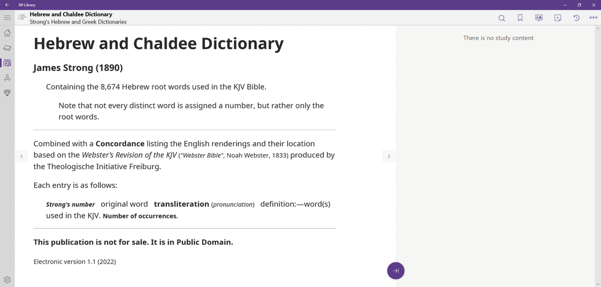

# JWPubLib

This is a collection of *.jwpub* archives that can be added to the **JW Library** app[^1] by simply downloading the "Latest release" of the one you want and tapping/double-clicking the downloaded file. It will appear in the "Guidelines" category (Library/DOWNLOADED).

These archives are a collection of reference works that are in the public domain, adapted for use with JW Library.

## Before you ask...

If you are looking for the **production code/methods**, that *cannot* be shared. If you want to roll your own, what you need is "out there", but I won't point you at it either. The same goes for the source material. Thanks for understanding and for not insisting.

____
### Bible Reading Schedules

* **Description**: Personal project with Bible reading schedules of varying sequences and lengths
* **Latest release**: [*BRS_1.0.jwpub*](https://filen.io/d/51255583-3ade-4224-be05-69aa21167da4#!M4cBHB1gutJQ8crmPoZLQb4E6MEJf3uf)
* **Released**: [2022-08-09](CHANGELOG.md/#brsjwpub---10---2022-08-09)
* **Note**: I would like to add 2- and 4-year *chronological* schedules, if any one has the breakdown

### Strong's *Hebrew and Chaldee Dictionary* + Strong's *Greek Dictionary of the New Testament*

* **Description**: Hebrew and Greek dictionaries + concordance
* **Latest release**: [*Str_1.1.jwpub*](https://filen.io/d/6c122873-beee-41cc-9274-c235fa3a6205#!daoLaIODOMwU91daN6XgIlgsOvxgNQQI)
* **Released**: [2022-08-22](CHANGELOG.md/#strjwpub---11---2022-08-22)
* **Note**: the archive is not searchable (yet) 

### Vine's *Expository Dictionary of New Testament Words*

* **Description**: More extensive Greek dictionary
* **Latest release**: [*VED_1.0.jwpub*](https://filen.io/d/3c26cccf-5caa-40d5-a1e0-f2a6dd93eca4#!ar7ZbBJT3pQHM6EGGA5S19xCWvesSFuF)
* **Released**: [2022-08-22](CHANGELOG.md/#vedjwpub---10---2022-08-28)
* **Note**: needs "polishing"
____
## Feedback

Feel free to [get in touch](https://github.com/erykjj/jwpublib/issues) and post any issues, suggestions, ideas, etc.

[^1]: [JW Library](https://www.jw.org/en/online-help/jw-library/) is a registered trademark of *Watch Tower Bible and Tract Society of Pennsylvania*.
