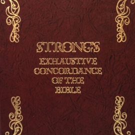

# JWPubLib

This is a collection of *.jwpub* archives that can be added to the **JW Library** app[^1] by simply downloading the "Latest release" of the one you want and tapping/double-clicking the downloaded file. It will appear in the "Guidelines" category (Library/DOWNLOADED).

These archives are a collection of reference works that are in the public domain, adapted for use with JW Library.

### Before you ask...

If you are looking for the **production code/methods**, that *cannot* be shared. If you want to roll your own, what you need is "out there", but I won't point you at it either. The same goes for the source material. Thanks for understanding and for not insisting.
____
____
## Bible Reading Schedules

* **Description**: Personal project with Bible reading schedules of varying sequences and lengths
* **Latest release**: [*BRS_1.1.jwpub*](https://github.com/erykjj/jwpublib/releases/tag/BRS_1.1)
* **Released**: [2022-12-11](CHANGELOG.md/#brs_11---2022-12-11)
* **Note**: Let me know if you would like this in another major language (eg., Spanish or French). **IMPORTANT**: Internal label IDs for check-boxes and date fields have changed! See [CHANGELOG](CHANGELOG.md/#brs_11---2022-12-11)

____
## Strong's *Hebrew and Chaldee Dictionary* + Strong's *Greek Dictionary of the New Testament*

* **Description**: Hebrew and Greek dictionaries + concordance
* **Latest release**: [*Str_1.4.jwpub*](https://github.com/erykjj/jwpublib/releases/tag/Str_1.4)
* **Released**: [2022-12-11](CHANGELOG.md/#str_14---2022-12-11)
* **Note**: Searchable 

____
## Vine's *Expository Dictionary of New Testament Words*

* **Description**: More extensive Greek dictionary (with links to *Strong's*)
* **Latest release**: [*VED_1.4.jwpub*](https://github.com/erykjj/jwpublib/releases/tag/VED_1.4)
* **Released**: [2022-12-11](CHANGELOG.md/#ved_14---2022-12-11)
* **Note**: Searchable
____
____
## Feedback

Feel free to [get in touch](https://github.com/erykjj/jwpublib/issues) and post any issues, suggestions, ideas, etc.

[^1]: [JW Library](https://www.jw.org/en/online-help/jw-library/) is a registered trademark of *Watch Tower Bible and Tract Society of Pennsylvania*.
