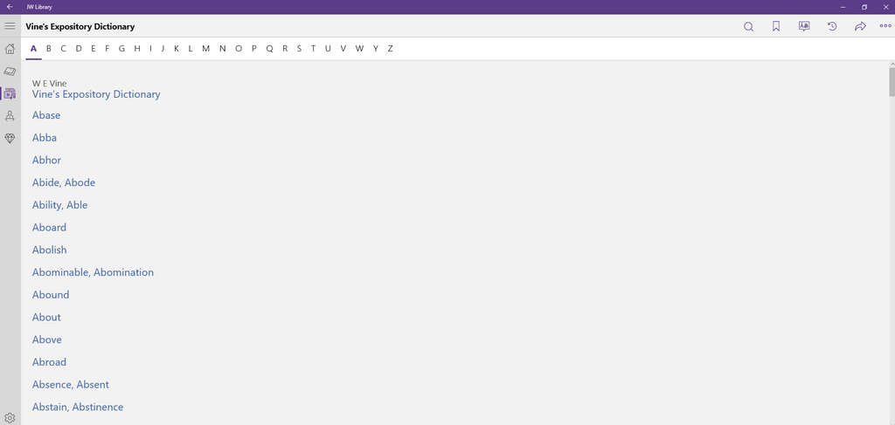

# JWPubLib

This is a collection of **Public Domain** reference works packaged as *.jwpub* archives that can be added to the **JW Library** app[^1] by simply downloading the "Latest release" and tapping/double-clicking the downloaded file. It will appear in the "Guidelines" category (Library/DOWNLOADED).

### Before you ask...

If you are looking for the **production code/methods**, that *cannot* be shared. The same goes for the source material. Thanks for understanding and for not insisting.
____
____
## Bible Reading Schedules

* **Description**: Personal project with Bible reading schedules of varying sequences and lengths
* **Latest release**: [*BRS_1.3.jwpub*](https://github.com/erykjj/jwpublib/releases/tag/BRS_1.3)
* **Released**: [2023-02-09](CHANGELOG.md/#brs_13---2023-02-09)
* **Languages**: English (E), French (F), Italian (I), Polish (P), Portuguese (T) and Spanish (S). Let me know if you would like this in another major language (eg., German)
* **Note**: If upgrading from a previous version, take note of your progress in case you need to re-tick some boxes

____
## Strong's *Hebrew and Chaldee Dictionary* + Strong's *Greek Dictionary of the New Testament*

* **Description**: Hebrew and Greek dictionaries + concordance (with back-links to [*Vine's*](README.md/#vines-expository-dictionary-of-new-testament-words))
* **Latest release**: [*Str_1.6.jwpub*](https://github.com/erykjj/jwpublib/releases/tag/Str_1.6)
* **Released**: [2023-02-19](CHANGELOG.md/#str_16---2023-02-19)
* **Note**: Searchable (limited) - it appears search results are not highlighted in newer versions of the JW Library app on Windows - I'm looking into that

____
## Vine's *Expository Dictionary of New Testament Words*

* **Description**: More extensive Greek dictionary (with links to [*Strong's*](README.md/#strongs-hebrew-and-chaldee-dictionary--strongs-greek-dictionary-of-the-new-testament))
* **Latest release**: [*VED_1.5.jwpub*](https://github.com/erykjj/jwpublib/releases/tag/VED_1.5)
* **Released**: [2023-02-15](CHANGELOG.md/#ved_15---2023-02-15)
* **Note**: Searchable (limited) - it appears search results are not highlighted in newer versions of the JW Library app on Windows - I'm looking into that
____
____
## Feedback

Feel free to [get in touch](https://github.com/erykjj/jwpublib/issues) and post any issues, suggestions, ideas, etc.

[^1]: [JW Library](https://www.jw.org/en/online-help/jw-library/) is a registered trademark of *Watch Tower Bible and Tract Society of Pennsylvania*.
